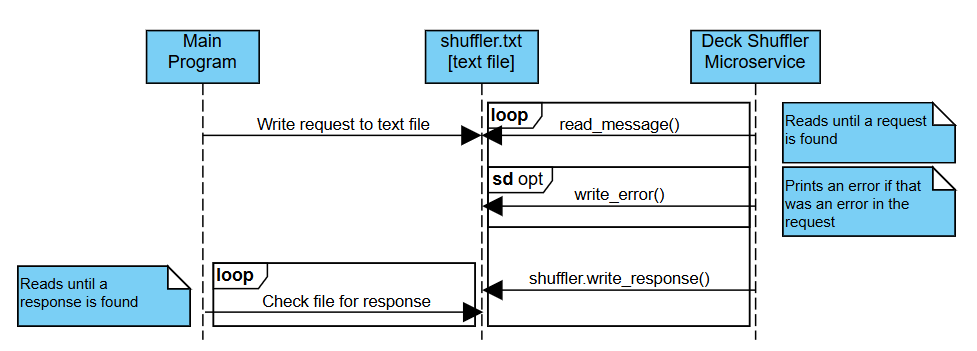

# CS361-Card-Shuffler-Microservice
Microservice A for Zachary Sherman - Card Shuffler

# How to Request Data

## Parameters:
**size** (int): The number of indices to shuffle. Required parameter. <br>
**seed** (int): The random seed to be used for the shuffle. Optional parameter. Random seed if not specified. <br>
**algorithm** (string - ["random","biased"]): Whether a true random or biased algorithm should be used. True random if not specified. <br>

## Detailed Information
The request should be made by deleting the content in the associated text file (shuffler.txt) and filling it with comma separated parameters. 
Parameters should be specified by first writing the word associated, (size, seed, algorithm), then an equal sign, then the value requested. 
If there is another parameter, then there should be a comma before the next parameter. 
The size parameter should always come first. 
There should be no whitespace.
The algorithm keywords are "random" and "biased", where "random" is an even distribution where all outcomes are just as likely, and "biased" is a derangement shuffle where no index is in the same place it started.
"random" is the default if nothing or an improper keyword is provided.
## Example Requests:
size=52 <br>
size=40,seed=567831 <br>
size=52,algorithm=random <br>
size=100,seed=648973,algorithm=biased <br>

## Example Pseudocode:
```
open text file:
    delete all content in text file
    write request to text file
```

# How to Receive Data
Data will be provided in a comma separated list placed into the same text file used to request the data.
Indices will be placed one after the other with commas separating them and no white space all on one line.
You can read from the text file by periodically checking if the file has been updated (suggested), or by waiting a period of time.
A periodic check example is given below. 
The MS will try to handle bad inputs to the best of its ability, but if there is a fatal error in the request received, the response will simply be "ERROR"

## Example Response:
**Request**: <br>
size=10 <br>
**Response**:  <br>
2,7,0,1,9,5,3,6,8,4 <br>

## Example Pseudocode:
```
function read_text_file
    while true:
        open file
            read line from text file
            if line does not start with "size"
                return the line
        wait short time period
```

# UML:


